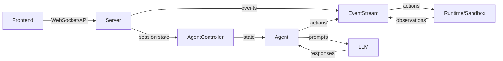

# Cascade Chat Conversation

  Note: _This is purely the output of the chat conversation and does not contain any raw data, codebase snippets, etc. used to generate the output._

### User Input

Walk me through the architecture of this repo

### Planner Response

I'll create a brief plan to structure the walkthrough, then scan the repository structure and key docs to ground the explanation.

*Updated todo list*

### Planner Response

I’m going to scan the repository’s top level and locate key files (README, docs, dependency manifests) to ground an accurate architecture overview. Running discovery steps in parallel to be fast.

*Listed directory [OpenHands](file:///Users/hren/Downloads/OpenHands) *

*Searched filesystem*

*Searched filesystem*

*Searched filesystem*

*Searched filesystem*

*Searched filesystem*

*Searched filesystem*

*Searched filesystem*

*Searched filesystem*

*Searched filesystem*

### Planner Response

I’m going to open the main README, project manifests, and list core directories to accurately map components, entry points, and dependencies. Running these file reads and directory listings in parallel for speed.

*Viewed [README.md](file:///Users/hren/Downloads/OpenHands/README.md) *

*Viewed [pyproject.toml](file:///Users/hren/Downloads/OpenHands/pyproject.toml) *

*Viewed [docker-compose.yml](file:///Users/hren/Downloads/OpenHands/docker-compose.yml) *

*Viewed [config.template.toml](file:///Users/hren/Downloads/OpenHands/config.template.toml) *

*Viewed [README.md](file:///Users/hren/Downloads/OpenHands/openhands/README.md) *

*Viewed [README.md](file:///Users/hren/Downloads/OpenHands/frontend/README.md) *

*Viewed [README.md](file:///Users/hren/Downloads/OpenHands/enterprise/README.md) *

*Viewed [README.md](file:///Users/hren/Downloads/OpenHands/microagents/README.md) *

*Viewed [pyproject.toml](file:///Users/hren/Downloads/OpenHands/openhands-cli/pyproject.toml) *

*Viewed [package.json](file:///Users/hren/Downloads/OpenHands/openhands-ui/package.json) *

*Viewed [package.json](file:///Users/hren/Downloads/OpenHands/frontend/package.json) *

*Listed directory [openhands](file:///Users/hren/Downloads/OpenHands/openhands) *

*Listed directory [openhands-cli](file:///Users/hren/Downloads/OpenHands/openhands-cli) *

*Listed directory [openhands-ui](file:///Users/hren/Downloads/OpenHands/openhands-ui) *

*Listed directory [frontend](file:///Users/hren/Downloads/OpenHands/frontend) *

*Listed directory [enterprise](file:///Users/hren/Downloads/OpenHands/enterprise) *

*Listed directory [microagents](file:///Users/hren/Downloads/OpenHands/microagents) *

*Listed directory [evaluation](file:///Users/hren/Downloads/OpenHands/evaluation) *

*Listed directory [server](file:///Users/hren/Downloads/OpenHands/openhands/server) *

*Viewed [README.md](file:///Users/hren/Downloads/OpenHands/openhands/server/README.md) *

*Updated todo list*

### Planner Response

To give you an accurate architectural walkthrough of the core runtime loop and entry points, I’ll open the CLI entry, server app, and a few core modules to map responsibilities.

*Grep searched codebase*

### Planner Response

I’ll open key entry points to confirm how the app is launched and how components wire together, focusing on `openhands.cli.entry:main` and the server [__main__.py](cci:7://file:///Users/hren/Downloads/OpenHands/openhands/server/__main__.py:0:0-0:0).

*Viewed [entry.py](file:///Users/hren/Downloads/OpenHands/openhands/cli/entry.py) *

### Planner Response

# OpenHands Architecture Walkthrough

## High-level Overview
- **Mono-repo** with:
  - **Core Python engine** ([openhands/](cci:7://file:///Users/hren/Downloads/OpenHands/openhands:0:0-0:0)): agents, controller, events, runtime, LLM, server.
  - **Web server** ([openhands/server/](cci:7://file:///Users/hren/Downloads/OpenHands/openhands/server:0:0-0:0)): FastAPI + WebSocket to drive the app and serve frontend assets.
  - **Frontend web app** ([frontend/](cci:7://file:///Users/hren/Downloads/OpenHands/frontend:0:0-0:0)): React/Remix SPA connecting to the server via HTTP/WebSocket.
  - **Design system** ([openhands-ui/](cci:7://file:///Users/hren/Downloads/OpenHands/openhands-ui:0:0-0:0)): reusable React UI components.
  - **Standalone CLI/TUI** ([openhands-cli/](cci:7://file:///Users/hren/Downloads/OpenHands/openhands-cli:0:0-0:0)): packaged separately, uses the v1 agent SDK.
  - **Enterprise server** ([enterprise/](cci:7://file:///Users/hren/Downloads/OpenHands/enterprise:0:0-0:0)): SaaS-specific extensions/overrides (source-available).
  - **Eval framework** ([evaluation/](cci:7://file:///Users/hren/Downloads/OpenHands/evaluation:0:0-0:0)): benchmarks and tools.
  - **Containers** ([containers/](cci:7://file:///Users/hren/Downloads/OpenHands/containers:0:0-0:0), [docker-compose.yml](cci:7://file:///Users/hren/Downloads/OpenHands/docker-compose.yml:0:0-0:0)): dockerized runtime + app.

## Core runtime mental model
OpenHands is an event-driven agent system:
- The **Agent** uses an **LLM** to decide the next **Action**.
- The **Runtime** executes actions (edit files, run commands, browse) and emits **Observations**.
- An **AgentController** orchestrates the loop and state.
- An **EventStream** carries actions/observations between components.
- The **Server** hosts sessions and brokers client communication.

See [openhands/README.md](cci:7://file:///Users/hren/Downloads/OpenHands/openhands/README.md:0:0-0:0) for core class roles, and [openhands/server/README.md](cci:7://file:///Users/hren/Downloads/OpenHands/openhands/server/README.md:0:0-0:0) for server workflow.

## Top-level packages and responsibilities
- **[openhands/](cci:7://file:///Users/hren/Downloads/OpenHands/openhands:0:0-0:0)** (core library; packaged as `openhands-ai` in [pyproject.toml](cci:7://file:///Users/hren/Downloads/OpenHands/pyproject.toml:0:0-0:0))
  - **[cli/](cci:7://file:///Users/hren/Downloads/OpenHands/openhands/cli:0:0-0:0)**: entrypoint and launcher. `openhands.cli.entry:main` routes to `serve` (GUI server) or [cli](cci:7://file:///Users/hren/Downloads/OpenHands/openhands/cli:0:0-0:0).
    - Entry script is wired via `[tool.poetry.scripts] openhands = "openhands.cli.entry:main"`.
    - File: [openhands/cli/entry.py](cci:7://file:///Users/hren/Downloads/OpenHands/openhands/cli/entry.py:0:0-0:0).
  - **[server/](cci:7://file:///Users/hren/Downloads/OpenHands/openhands/server:0:0-0:0)**: FastAPI app, WebSocket handlers, sessions, middleware.
    - Key files: [listen.py](cci:7://file:///Users/hren/Downloads/OpenHands/openhands/server/listen.py:0:0-0:0) (ASGI app), [__main__.py](cci:7://file:///Users/hren/Downloads/OpenHands/openhands/server/__main__.py:0:0-0:0), [session/](cci:7://file:///Users/hren/Downloads/OpenHands/openhands/server/session:0:0-0:0), [routes/](cci:7://file:///Users/hren/Downloads/OpenHands/openhands/server/routes:0:0-0:0), [middleware.py](cci:7://file:///Users/hren/Downloads/OpenHands/openhands/server/middleware.py:0:0-0:0), [settings.py](cci:7://file:///Users/hren/Downloads/OpenHands/openhands/server/settings.py:0:0-0:0).
    - Dev server: `uvicorn openhands.server.listen:app`.
  - **[controller/](cci:7://file:///Users/hren/Downloads/OpenHands/openhands/controller:0:0-0:0)**: `AgentController` orchestration.
  - **[agenthub/](cci:7://file:///Users/hren/Downloads/OpenHands/openhands/agenthub:0:0-0:0)**: built-in agents (e.g., CodeAct-like agent implementations).
  - **[events/](cci:7://file:///Users/hren/Downloads/OpenHands/openhands/events:0:0-0:0)**: event types and the `EventStream`.
  - **[llm/](cci:7://file:///Users/hren/Downloads/OpenHands/openhands/llm:0:0-0:0)**: LLM broker and adapters via LiteLLM (`litellm` in [pyproject.toml](cci:7://file:///Users/hren/Downloads/OpenHands/pyproject.toml:0:0-0:0)).
  - **[runtime/](cci:7://file:///Users/hren/Downloads/OpenHands/openhands/runtime:0:0-0:0)**: sandbox orchestration (Docker-backed), command execution, VSCode integration.
  - **[memory/](cci:7://file:///Users/hren/Downloads/OpenHands/openhands/memory:0:0-0:0)**: memory and summarization utilities.
  - **[microagent/](cci:7://file:///Users/hren/Downloads/OpenHands/openhands/microagent:0:0-0:0)**: prompt extension system and microagent plumbing.
  - **[security/](cci:7://file:///Users/hren/Downloads/OpenHands/openhands/security:0:0-0:0)**: security analyzer support.
  - **[resolver/](cci:7://file:///Users/hren/Downloads/OpenHands/openhands/resolver:0:0-0:0)**: repo/PR automation flows.
  - **[integrations/](cci:7://file:///Users/hren/Downloads/OpenHands/openhands/integrations:0:0-0:0)**: VSCode extension and other integrations.
  - **[utils/](cci:7://file:///Users/hren/Downloads/OpenHands/openhands/utils:0:0-0:0), [core/](cci:7://file:///Users/hren/Downloads/OpenHands/openhands/core:0:0-0:0), [storage/](cci:7://file:///Users/hren/Downloads/OpenHands/openhands/storage:0:0-0:0), [io/](cci:7://file:///Users/hren/Downloads/OpenHands/openhands/io:0:0-0:0), [app_server/](cci:7://file:///Users/hren/Downloads/OpenHands/openhands/app_server:0:0-0:0)**: shared infra and utilities.

- **[frontend/](cci:7://file:///Users/hren/Downloads/OpenHands/frontend:0:0-0:0)** (React/Remix SPA; served by the backend in prod)
  - Tech stack: React, Remix SPA mode, Vite, Redux, TanStack Query, Tailwind.
  - Local dev: `npm run dev` (MSW mocked backend) at `http://localhost:3001`.
  - Prod: `make build && make run` or `make start-backend` + `make start-frontend`.
  - Files: [frontend/README.md](cci:7://file:///Users/hren/Downloads/OpenHands/frontend/README.md:0:0-0:0), [frontend/package.json](cci:7://file:///Users/hren/Downloads/OpenHands/frontend/package.json:0:0-0:0).

- **[openhands-ui/](cci:7://file:///Users/hren/Downloads/OpenHands/openhands-ui:0:0-0:0)** (design system)
  - Components published as `@openhands/ui`.
  - Built with Vite, Storybook; peer deps: React 19 + Tailwind 4.
  - Files: [openhands-ui/package.json](cci:7://file:///Users/hren/Downloads/OpenHands/openhands-ui/package.json:0:0-0:0), [components/](cci:7://file:///Users/hren/Downloads/OpenHands/openhands-ui/components:0:0-0:0), [index.ts](cci:7://file:///Users/hren/Downloads/OpenHands/openhands-ui/index.ts:0:0-0:0).

- **[openhands-cli/](cci:7://file:///Users/hren/Downloads/OpenHands/openhands-cli:0:0-0:0)** (standalone CLI/TUI)
  - Separate package named [openhands](cci:7://file:///Users/hren/Downloads/OpenHands/openhands:0:0-0:0) (PyPI name for TUI; different from `openhands-ai`).
  - Depends on `openhands-sdk` + `openhands-tools` (agent v1 SDK).
  - Files: [openhands-cli/pyproject.toml](cci:7://file:///Users/hren/Downloads/OpenHands/openhands-cli/pyproject.toml:0:0-0:0), [openhands_cli/](cci:7://file:///Users/hren/Downloads/OpenHands/openhands-cli/openhands_cli:0:0-0:0), [build.py](cci:7://file:///Users/hren/Downloads/OpenHands/openhands-cli/build.py:0:0-0:0).

- **[enterprise/](cci:7://file:///Users/hren/Downloads/OpenHands/enterprise:0:0-0:0)** (SaaS/Cloud)
  - Extends/overrides OSS server pieces via dynamic imports to add auth, settings, GitHub token flow, etc.
  - Entrypoints like [saas_server.py](cci:7://file:///Users/hren/Downloads/OpenHands/enterprise/saas_server.py:0:0-0:0).
  - Licensed under Polyform Free Trial. See [enterprise/README.md](cci:7://file:///Users/hren/Downloads/OpenHands/enterprise/README.md:0:0-0:0).

- **[evaluation/](cci:7://file:///Users/hren/Downloads/OpenHands/evaluation:0:0-0:0)**
  - Benchmarks (SWE-bench, BrowserGym, etc.), integration tests, analysis tools.
  - Optional deps in `[tool.poetry.group.evaluation.dependencies]`.

- **[containers/](cci:7://file:///Users/hren/Downloads/OpenHands/containers:0:0-0:0)** and [docker-compose.yml](cci:7://file:///Users/hren/Downloads/OpenHands/docker-compose.yml:0:0-0:0)
  - App container image (`containers/app/Dockerfile`).
  - Runtime container image (sandbox) configured via `SANDBOX_RUNTIME_CONTAINER_IMAGE`.
  - [docker-compose.yml](cci:7://file:///Users/hren/Downloads/OpenHands/docker-compose.yml:0:0-0:0) mounts `~/.openhands` and a workspace volume; exposes `3000`.

- **[microagents/](cci:7://file:///Users/hren/Downloads/OpenHands/microagents:0:0-0:0)**
  - Shareable microagents shipped with the project.
  - Repo-specific private microagents live in a project’s `.openhands/microagents/repo.md`.
  - See [microagents/README.md](cci:7://file:///Users/hren/Downloads/OpenHands/microagents/README.md:0:0-0:0).

## Build, packaging, and dependencies
- Root Python package: `openhands-ai` ([pyproject.toml](cci:7://file:///Users/hren/Downloads/OpenHands/pyproject.toml:0:0-0:0) with Poetry).
  - Script: [openhands](cci:7://file:///Users/hren/Downloads/OpenHands/openhands:0:0-0:0) → `openhands.cli.entry:main`.
  - Notable deps: `litellm`, `fastapi`, `uvicorn`, `sse-starlette`, `docker`, `playwright`, `python-socketio`, `opentelemetry`, optional runtime integrations (Modal, E2B, Runloop, etc.).
  - V1 agent SDK deps pinned via git (e.g., `openhands-sdk`, `openhands-agent-server`) in [pyproject.toml](cci:7://file:///Users/hren/Downloads/OpenHands/pyproject.toml:0:0-0:0).
- Frontend uses Node 22+, Vite 7, React 19; see [frontend/package.json](cci:7://file:///Users/hren/Downloads/OpenHands/frontend/package.json:0:0-0:0).
- UI library uses Node/Bun; see [openhands-ui/package.json](cci:7://file:///Users/hren/Downloads/OpenHands/openhands-ui/package.json:0:0-0:0).
- CLI/TUI is separately packaged via Hatchling in [openhands-cli/pyproject.toml](cci:7://file:///Users/hren/Downloads/OpenHands/openhands-cli/pyproject.toml:0:0-0:0).

## Configuration model
- Primary config template: [config.template.toml](cci:7://file:///Users/hren/Downloads/OpenHands/config.template.toml:0:0-0:0).
  - Sections: `[core]`, `[llm]` (multi-model support; uses LiteLLM), `[agent]` (feature toggles), `[sandbox]` (Docker runtime), `[security]`, `[condenser]` (history management), `[mcp]` (Model Context Protocol servers), `[model_routing]`.
- Server envs (from [openhands/server/README.md](cci:7://file:///Users/hren/Downloads/OpenHands/openhands/server/README.md:0:0-0:0)):
  - `LLM_API_KEY`, `LLM_MODEL`, `SANDBOX_VOLUMES`, etc.
- Workspace mounting and runtime image configured via env or TOML:
  - Example: `SANDBOX_RUNTIME_CONTAINER_IMAGE`, `WORKSPACE_MOUNT_PATH`.

## Entry points and runtime flow
- CLI:
  - [openhands](cci:7://file:///Users/hren/Downloads/OpenHands/openhands:0:0-0:0) default runs the interactive CLI ([openhands/cli/entry.py](cci:7://file:///Users/hren/Downloads/OpenHands/openhands/cli/entry.py:0:0-0:0) → `run_cli_command()`).
  - `openhands serve` launches the GUI server via `openhands.cli.gui_launcher.launch_gui_server()`.
- Server:
  - App module: `openhands.server.listen:app`.
  - WebSocket endpoint (`/ws`) brokers sessions; static frontend served in prod.
  - Internals: [session/](cci:7://file:///Users/hren/Downloads/OpenHands/openhands/server/session:0:0-0:0) (Session lifecycle), [conversation_manager/](cci:7://file:///Users/hren/Downloads/OpenHands/openhands/server/conversation_manager:0:0-0:0), [routes/](cci:7://file:///Users/hren/Downloads/OpenHands/openhands/server/routes:0:0-0:0), [middleware.py](cci:7://file:///Users/hren/Downloads/OpenHands/openhands/server/middleware.py:0:0-0:0).
- Docker:
  - [docker-compose.yml](cci:7://file:///Users/hren/Downloads/OpenHands/docker-compose.yml:0:0-0:0) builds app container, mounts docker.sock and `~/.openhands`, exposes port 3000.
  - Runtime sandbox runs containers for command execution and tools (configurable).

## Frontend integration
- The app serves the built SPA under the server; dev uses MSW mocking.
- Real-time updates via WebSocket (`socket.io-client` in [frontend/package.json](cci:7://file:///Users/hren/Downloads/OpenHands/frontend/package.json:0:0-0:0)).

## Enterprise specifics
- Extends OSS server by stacking middleware and overriding configs (see [enterprise/README.md](cci:7://file:///Users/hren/Downloads/OpenHands/enterprise/README.md:0:0-0:0)).
- Differences mainly in auth, user settings, GitHub token lifecycle.
- Used by OpenHands Cloud; not for multi-tenant on OSS.

## Evaluation stack
- Optional dependency group `[tool.poetry.group.evaluation]` enables BrowserGym, SWE-bench, datasets, etc.
- Benchmarks under [evaluation/benchmarks/](cci:7://file:///Users/hren/Downloads/OpenHands/evaluation/benchmarks:0:0-0:0), with README files per benchmark.

## Where to look to extend
- Add an agent: see [openhands/agenthub/](cci:7://file:///Users/hren/Downloads/OpenHands/openhands/agenthub:0:0-0:0), `openhands/controller/AgentController`.
- Add a tool/runtime capability: [openhands/runtime/](cci:7://file:///Users/hren/Downloads/OpenHands/openhands/runtime:0:0-0:0), [openhands/events/](cci:7://file:///Users/hren/Downloads/OpenHands/openhands/events:0:0-0:0).
- Integrate an LLM/provider: [openhands/llm/](cci:7://file:///Users/hren/Downloads/OpenHands/openhands/llm:0:0-0:0) and configure in [config.template.toml](cci:7://file:///Users/hren/Downloads/OpenHands/config.template.toml:0:0-0:0) `[llm.*]`.
- Frontend features: [frontend/src/](cci:7://file:///Users/hren/Downloads/OpenHands/frontend/src:0:0-0:0) (routes, components, state, services).
- UI components: [openhands-ui/components/](cci:7://file:///Users/hren/Downloads/OpenHands/openhands-ui/components:0:0-0:0).

# Findings
- **Core package name**: `openhands-ai` ([pyproject.toml](cci:7://file:///Users/hren/Downloads/OpenHands/pyproject.toml:0:0-0:0)).
- **CLI script**: [openhands](cci:7://file:///Users/hren/Downloads/OpenHands/openhands:0:0-0:0) → `openhands.cli.entry:main`.
- **Server app**: `uvicorn openhands.server.listen:app`.
- **Config**: [config.template.toml](cci:7://file:///Users/hren/Downloads/OpenHands/config.template.toml:0:0-0:0) is comprehensive and sorted by sections with sensible defaults.
- **Docker topology**: App container hosts server + serves SPA; sandbox runtime runs commands/tools inside a configurable image.
- **Event-driven**: `EventStream` is the backbone for actions/observations; server mediates sessions and streams between UI and agent/runtime.

# Recommended Actions
- **[run-locally]** Use the uv-based launcher from [README.md](cci:7://file:///Users/hren/Downloads/OpenHands/README.md:0:0-0:0) to quickly spin up server/GUI:
  - `uvx --python 3.12 --from openhands-ai openhands serve`
- **[dev-mode]** For frontend work, run SPA with MSW:
  - `cd frontend && npm install && npm run dev`
- **[server-dev]** For backend-only:
  - Build frontend once, then `uvicorn openhands.server.listen:app --reload --port 3000`
- **[customize]** Copy [config.template.toml](cci:7://file:///Users/hren/Downloads/OpenHands/config.template.toml:0:0-0:0) to your config and adjust `[llm]`, `[agent]`, `[sandbox]`, `[mcp]` as needed.

# Status
- Completed a repo-wide scan and mapped architecture, components, entry points, and configuration with direct references to files and directories. If you want, I can deep-dive into a specific area next (e.g., `Runtime` Docker flow, `EventStream` types, or server routes).

### User Input

What is the main use case of this repo? What are similar repos? How does this repo differentiate from others? What specific values does it deliver

*Updated todo list*

### Planner Response

# Main Use Case

- **[AI software development agent platform]**  
  Build, run, and iterate with autonomous/semi-autonomous coding agents that can read/edit files, run commands in a sandbox, browse, use tools, and interact via a web UI or CLI.
  - Evidence:
    - [README.md](cci:7://file:///Users/hren/Downloads/OpenHands/README.md:0:0-0:0): “platform for software development agents powered by AI” and local/Cloud usage.
    - [openhands/README.md](cci:7://file:///Users/hren/Downloads/OpenHands/openhands/README.md:0:0-0:0): core classes (`Agent`, `AgentController`, `Runtime`, `EventStream`).
    - [openhands/server/README.md](cci:7://file:///Users/hren/Downloads/OpenHands/openhands/server/README.md:0:0-0:0): FastAPI/WebSocket server that manages sessions and brokers events.
    - [config.template.toml](cci:7://file:///Users/hren/Downloads/OpenHands/config.template.toml:0:0-0:0): end-to-end configurable agent, LLMs, sandbox, security, MCP, condenser.

- **[Local-first dev workflow with isolation]**  
  Run agents locally with a Docker-based runtime sandbox that mounts your workspace and executes commands/tools safely.
  - Evidence:
    - [docker-compose.yml](cci:7://file:///Users/hren/Downloads/OpenHands/docker-compose.yml:0:0-0:0): mounts `~/.openhands` and a workspace; exposes `3000`.
    - `[sandbox]` in [config.template.toml](cci:7://file:///Users/hren/Downloads/OpenHands/config.template.toml:0:0-0:0): runtime container image, volumes, GPU, plugins.

- **[Full-stack experience]**  
  Web GUI ([frontend/](cci:7://file:///Users/hren/Downloads/OpenHands/frontend:0:0-0:0)) + backend ([openhands/server/](cci:7://file:///Users/hren/Downloads/OpenHands/openhands/server:0:0-0:0)) + design system ([openhands-ui/](cci:7://file:///Users/hren/Downloads/OpenHands/openhands-ui:0:0-0:0)) + CLI ([openhands/cli/](cci:7://file:///Users/hren/Downloads/OpenHands/openhands/cli:0:0-0:0) and [openhands-cli/](cci:7://file:///Users/hren/Downloads/OpenHands/openhands-cli:0:0-0:0)) for multiple interaction modes.
  - Evidence:
    - [frontend/README.md](cci:7://file:///Users/hren/Downloads/OpenHands/frontend/README.md:0:0-0:0): Remix SPA dev/prod flows.
    - [pyproject.toml](cci:7://file:///Users/hren/Downloads/OpenHands/pyproject.toml:0:0-0:0) → `[tool.poetry.scripts] openhands = "openhands.cli.entry:main"`.
    - [openhands-ui/package.json](cci:7://file:///Users/hren/Downloads/OpenHands/openhands-ui/package.json:0:0-0:0): reusable UI components.
    - [openhands-cli/pyproject.toml](cci:7://file:///Users/hren/Downloads/OpenHands/openhands-cli/pyproject.toml:0:0-0:0): standalone CLI package.

# Similar Repos/Tools

- **Aider** (aiderchat/aider): Git-aware chat coding assistant in terminal.
- **Continue** (continuedev/continue): IDE-first assistant (VSCode/JetBrains).
- **Open Interpreter** (OpenInterpreter/open-interpreter): natural-language-to-code execution.
- **AutoGPT** (Significant-Gravitas/AutoGPT): general agent framework with tools.
- **Cline** (VSCode dev-agent extension).
- Commercial: GitHub Copilot/Copilot Workspace, Cursor, Devin (Cognition).

# How OpenHands Differentiates

- **[Event-driven agent core with explicit orchestration]**  
  Clear separation of concerns with `EventStream`, `AgentController`, `Runtime`, `LLM`, making it extensible/observable.
  - Evidence: [openhands/README.md](cci:7://file:///Users/hren/Downloads/OpenHands/openhands/README.md:0:0-0:0) class map; [openhands/events/](cci:7://file:///Users/hren/Downloads/OpenHands/openhands/events:0:0-0:0), [openhands/controller/](cci:7://file:///Users/hren/Downloads/OpenHands/openhands/controller:0:0-0:0), [openhands/runtime/](cci:7://file:///Users/hren/Downloads/OpenHands/openhands/runtime:0:0-0:0), [openhands/llm/](cci:7://file:///Users/hren/Downloads/OpenHands/openhands/llm:0:0-0:0).

- **[Sandboxed execution via Docker runtime]**  
  First-class runtime with containerized command execution and workspace mounts, optional GPU, plugin init, volume control.
  - Evidence: [docker-compose.yml](cci:7://file:///Users/hren/Downloads/OpenHands/docker-compose.yml:0:0-0:0); `[sandbox]` in [config.template.toml](cci:7://file:///Users/hren/Downloads/OpenHands/config.template.toml:0:0-0:0).

- **[Built-in browsing and tool ecosystem]**  
  Browser tasks via BrowserGym; optional MCP servers; rich tool stack (file ops, shell, Jupyter, editor).
  - Evidence: [pyproject.toml](cci:7://file:///Users/hren/Downloads/OpenHands/pyproject.toml:0:0-0:0) deps `browsergym-*`, `fastmcp`; [config.template.toml](cci:7://file:///Users/hren/Downloads/OpenHands/config.template.toml:0:0-0:0) `[mcp]`, `[agent]` toggles.

- **[Microagents system]**  
  Shareable and repo-specific prompt extensions with frontmatter, always-on repo agents, keyword-triggered expertise.
  - Evidence: [microagents/README.md](cci:7://file:///Users/hren/Downloads/OpenHands/microagents/README.md:0:0-0:0); `.openhands/microagents/repo.md` pattern.

- **[Full-stack OSS with UI library and server]**  
  Ships a production web server, SPA frontend, and a reusable UI kit—many tools are CLI-only or IDE-only.
  - Evidence: [openhands/server/](cci:7://file:///Users/hren/Downloads/OpenHands/openhands/server:0:0-0:0), [frontend/](cci:7://file:///Users/hren/Downloads/OpenHands/frontend:0:0-0:0), [openhands-ui/](cci:7://file:///Users/hren/Downloads/OpenHands/openhands-ui:0:0-0:0).

- **[Evaluation-ready]**  
  Extensive [evaluation/](cci:7://file:///Users/hren/Downloads/OpenHands/evaluation:0:0-0:0) suite and optional dependency group to run popular dev/browsing/code benchmarks.
  - Evidence: [evaluation/README.md](cci:7://file:///Users/hren/Downloads/OpenHands/evaluation/README.md:0:0-0:0); [pyproject.toml](cci:7://file:///Users/hren/Downloads/OpenHands/pyproject.toml:0:0-0:0) `[tool.poetry.group.evaluation.dependencies]`.

- **[Multiple launch modes]**  
  `openhands serve` for GUI, CLI mode, headless mode, GitHub Action integration.
  - Evidence: [README.md](cci:7://file:///Users/hren/Downloads/OpenHands/README.md:0:0-0:0) “Other ways to run OpenHands”; [openhands/cli/entry.py](cci:7://file:///Users/hren/Downloads/OpenHands/openhands/cli/entry.py:0:0-0:0).

- **[Enterprise overlays (source-available)]**  
  SaaS-oriented overrides via [enterprise/](cci:7://file:///Users/hren/Downloads/OpenHands/enterprise:0:0-0:0) that stack on/replace OSS server parts (auth, settings, GitHub token lifecycle).
  - Evidence: [enterprise/README.md](cci:7://file:///Users/hren/Downloads/OpenHands/enterprise/README.md:0:0-0:0).

# Specific Value Delivered

- **[Productivity]**  
  - Single command to start a full agent environment with UI (`openhands serve`).
  - Agents can iteratively edit code, run tests/commands, browse docs, and summarize output.

- **[Safety and Reproducibility]**  
  - Docker runtime isolation; configurable volumes and permissions.
  - Conversation/session control; configurable condensers; trajectory saving.
  - Evidence: `[core] save_trajectory_path`, `enable_history_truncation` in [config.template.toml](cci:7://file:///Users/hren/Downloads/OpenHands/config.template.toml:0:0-0:0).

- **[Extensibility]**  
  - Plug different LLMs/providers through LiteLLM.
  - Add tools, microagents, runtime plugins, or integrate MCP servers.
  - Evidence: [pyproject.toml](cci:7://file:///Users/hren/Downloads/OpenHands/pyproject.toml:0:0-0:0) `litellm`, `google-*`, `anthropic`, `openai`; [config.template.toml](cci:7://file:///Users/hren/Downloads/OpenHands/config.template.toml:0:0-0:0) `[llm.*]`, `[mcp]`.

- **[Team consistency]**  
  - Repo-specific microagents enforce conventions, onboarding, and workflows per repo.
  - Evidence: [microagents/README.md](cci:7://file:///Users/hren/Downloads/OpenHands/microagents/README.md:0:0-0:0) and `.openhands/microagents/repo.md` pattern.

- **[Research and benchmarking]**  
  - Ready-to-run evaluation harness across diverse benchmarks for comparing agents/models.
  - Evidence: [evaluation/benchmarks/](cci:7://file:///Users/hren/Downloads/OpenHands/evaluation/benchmarks:0:0-0:0) and evaluation dependency group.

# Recommended Actions

- **[Quick try]** Launch GUI locally:
  - `uvx --python 3.12 --from openhands-ai openhands serve` (see [README.md](cci:7://file:///Users/hren/Downloads/OpenHands/README.md:0:0-0:0)).
- **[Customize]** Copy [config.template.toml](cci:7://file:///Users/hren/Downloads/OpenHands/config.template.toml:0:0-0:0) and tune `[llm]`, `[agent]`, `[sandbox]`, `[mcp]`.
- **[Team setup]** Add `.openhands/microagents/repo.md` to encode repo practices.
- **[Benchmark]** Enable the evaluation dependency group in [pyproject.toml](cci:7://file:///Users/hren/Downloads/OpenHands/pyproject.toml:0:0-0:0) and run [evaluation/](cci:7://file:///Users/hren/Downloads/OpenHands/evaluation:0:0-0:0).

# Status

- Provided the main use case, comparable projects, clear differentiators with repo citations, and the concrete value it delivers for individual developers, teams, and researchers.

### User Input

Does this repo uses agentic framework such as LangGraph? If not, what does it use?

### Planner Response

I’ll search the codebase and dependency manifests for references to LangGraph or similar agent frameworks (LangChain, CrewAI, AutoGen) to confirm what’s used. Running these searches in parallel for speed.

*Grep searched codebase*

*Grep searched codebase*

*Grep searched codebase*

*Grep searched codebase*

*Grep searched codebase*

*Grep searched codebase*

*Listed directory [controller](file:///Users/hren/Downloads/OpenHands/openhands/controller) *

### Planner Response

I'll verify whether LangGraph or similar frameworks are referenced in code or manifests, then cite what the repo actually uses by opening core classes and LLM integration. Running targeted searches and a couple of quick file reads in parallel.

*Searched web for site:github.com All-Hands-AI OpenHands LangGraph*

### Planner Response

# Findings

- **[No LangGraph/LangChain in code]**
  - No imports of LangGraph, LangChain, CrewAI, AutoGen, LlamaIndex found in source (`openhands/**`).
  - Only mentions surfaced in lockfiles (transitive, not used in code). The “autogen” hits are Alembic’s “autogenerate,” not the AutoGen framework.
  - Evidence: code search for `langgraph`, `langchain`, `crewai`, `llamaindex`, `autogen` yielded no hits in `openhands/**`; only lockfiles matched.

- **[What it uses instead]**
  - A homegrown, event-driven agent runtime with explicit components:
    - `Agent`, `AgentController`, `State`, `EventStream`, `Runtime`, `LLM`.
    - Evidence: [openhands/README.md](cci:7://file:///Users/hren/Downloads/OpenHands/openhands/README.md:0:0-0:0), [openhands/controller/agent_controller.py](cci:7://file:///Users/hren/Downloads/OpenHands/openhands/controller/agent_controller.py:0:0-0:0), [openhands/events/](cci:7://file:///Users/hren/Downloads/OpenHands/openhands/events:0:0-0:0), [openhands/runtime/](cci:7://file:///Users/hren/Downloads/OpenHands/openhands/runtime:0:0-0:0), [openhands/llm/](cci:7://file:///Users/hren/Downloads/OpenHands/openhands/llm:0:0-0:0).
  - LLM provider abstraction via LiteLLM (multi-provider, routing-ready).
    - Evidence: [pyproject.toml](cci:7://file:///Users/hren/Downloads/OpenHands/pyproject.toml:0:0-0:0) dependencies include `litellm`, `openai`, `anthropic`, `google-*`; `[llm]` in [config.template.toml](cci:7://file:///Users/hren/Downloads/OpenHands/config.template.toml:0:0-0:0).
  - Full-stack server + UI:
    - FastAPI/WebSocket server: [openhands/server/listen.py](cci:7://file:///Users/hren/Downloads/OpenHands/openhands/server/listen.py:0:0-0:0), [openhands/server/README.md](cci:7://file:///Users/hren/Downloads/OpenHands/openhands/server/README.md:0:0-0:0).
    - SPA frontend: [frontend/](cci:7://file:///Users/hren/Downloads/OpenHands/frontend:0:0-0:0) served by backend in prod.
  - Prompt extension and tool ecosystem:
    - Microagents: [microagents/](cci:7://file:///Users/hren/Downloads/OpenHands/microagents:0:0-0:0), `.openhands/microagents/repo.md`.
    - MCP support: `fastmcp`, configured in `[mcp]` of [config.template.toml](cci:7://file:///Users/hren/Downloads/OpenHands/config.template.toml:0:0-0:0).
  - Docker sandbox runtime for safe command execution:
    - Evidence: [docker-compose.yml](cci:7://file:///Users/hren/Downloads/OpenHands/docker-compose.yml:0:0-0:0), `[sandbox]` in [config.template.toml](cci:7://file:///Users/hren/Downloads/OpenHands/config.template.toml:0:0-0:0).

- **[Internal SDK (v1) usage]**
  - Uses its own “agent SDK” packages (not LangGraph) for the v1 path:
    - Evidence: [pyproject.toml](cci:7://file:///Users/hren/Downloads/OpenHands/pyproject.toml:0:0-0:0) pins `openhands-agent-server`, `openhands-sdk`, `openhands-tools` via Git subdirectories.

# How it differs from LangGraph-style frameworks

- **[EventStream-first architecture]**  
  Rather than DAG/graph node composition (LangGraph), OpenHands centers on an `EventStream` that carries actions/observations across `AgentController` and `Runtime` with a sessioned server model.  
  - Evidence: [openhands/README.md](cci:7://file:///Users/hren/Downloads/OpenHands/openhands/README.md:0:0-0:0) (diagram and class roles), [openhands/server/README.md](cci:7://file:///Users/hren/Downloads/OpenHands/openhands/server/README.md:0:0-0:0) (session and WebSocket flow).

- **[Opinionated runtime and UX]**  
  Ships a Docker-backed execution environment, a production web server, and a full UI kit, providing an end-to-end local-first dev agent experience out of the box.  
  - Evidence: [docker-compose.yml](cci:7://file:///Users/hren/Downloads/OpenHands/docker-compose.yml:0:0-0:0), [frontend/](cci:7://file:///Users/hren/Downloads/OpenHands/frontend:0:0-0:0), [openhands-ui/](cci:7://file:///Users/hren/Downloads/OpenHands/openhands-ui:0:0-0:0).

- **[Microagents + MCP]**  
  First-class prompt extension system and MCP tool integrations; not a graph-based behavior model.

# Specific values delivered (vs. generic agent frameworks)

- **[Turnkey dev experience]**  
  `openhands serve` launches the server + UI; agents can edit files, run tests, browse, all inside a sandbox.  
  - Evidence: [openhands/cli/entry.py](cci:7://file:///Users/hren/Downloads/OpenHands/openhands/cli/entry.py:0:0-0:0) routes `serve` to launch GUI server.

- **[Safety and control]**  
  Containerized runtime, volume control, session history/condensation, and configurable security analyzer.  
  - Evidence: `[sandbox]`, `[condenser]`, `[security]` in [config.template.toml](cci:7://file:///Users/hren/Downloads/OpenHands/config.template.toml:0:0-0:0).

- **[Extensibility without lock-in]**  
  Swap LLMs (LiteLLM), add microagents, bring MCP tools, and customize runtime/plugins, while keeping a clear orchestration core.

# Recommended Actions

- **[Integrate LangGraph if desired]**
  - Wrap the `AgentController` loop ([openhands/controller/agent_controller.py](cci:7://file:///Users/hren/Downloads/OpenHands/openhands/controller/agent_controller.py:0:0-0:0)) with a LangGraph node graph that:
    - Takes `State` and emits `Action` nodes.
    - Consumes `Observation` from `Runtime`.
  - Or build a thin adapter that maps EventStream events to LangGraph node inputs/outputs while keeping `Runtime` unchanged.

# Status

- Confirmed: the repo does not use LangGraph (or similar) in code. It uses its own event-driven agent core with LiteLLM integration, a Docker sandbox runtime, microagents, MCP support, and a full-stack server+UI.

### User Input

Would the implementation be improved with LangGraph? How does the agent achieve coding abilities now?

*Updated todo list*

### Planner Response

# Findings

- **[No LangGraph currently]**  
  I couldn’t find any usage of LangGraph/LangChain/CrewAI/AutoGen/LlamaIndex in the code. The agent system is homegrown and event-driven.
  - Evidence: searches found no imports in `openhands/**`; the “autogen” hits in the repo are Alembic “autogenerate,” not AutoGen.

- **[What it uses instead]**  
  A custom, event-driven agent runtime:
  - Core roles: `Agent`, `AgentController`, `State`, `EventStream`, `Runtime`, `LLM` in [openhands/](cci:7://file:///Users/hren/Downloads/OpenHands/openhands:0:0-0:0) (see [openhands/README.md](cci:7://file:///Users/hren/Downloads/OpenHands/openhands/README.md:0:0-0:0)).
  - LLM abstraction via LiteLLM in [openhands/llm/](cci:7://file:///Users/hren/Downloads/OpenHands/openhands/llm:0:0-0:0) with providers pinned in [pyproject.toml](cci:7://file:///Users/hren/Downloads/OpenHands/pyproject.toml:0:0-0:0).
  - Servered sessions via FastAPI/WebSocket ([openhands/server/listen.py](cci:7://file:///Users/hren/Downloads/OpenHands/openhands/server/listen.py:0:0-0:0), [openhands/server/README.md](cci:7://file:///Users/hren/Downloads/OpenHands/openhands/server/README.md:0:0-0:0)).
  - Config toggles for tools/features in [config.template.toml](cci:7://file:///Users/hren/Downloads/OpenHands/config.template.toml:0:0-0:0) (e.g., `[agent] enable_editor`, `enable_cmd`, `enable_browsing`, `enable_jupyter`).
  - Docker sandbox for safe command execution ([docker-compose.yml](cci:7://file:///Users/hren/Downloads/OpenHands/docker-compose.yml:0:0-0:0), `[sandbox]` in [config.template.toml](cci:7://file:///Users/hren/Downloads/OpenHands/config.template.toml:0:0-0:0)).

# Would LangGraph improve this?

- **Potential wins**
  - **[Multi-agent graphing]** Complex workflows decomposed as a graph of nodes/subgraphs (planners, solvers, reviewers).
  - **[Structured control flow]** Branching, retries, guards, timeouts at node boundaries instead of ad-hoc logic.
  - **[Checkpoints/persistence]** Built-in state checkpointing and resumability for long tasks.
  - **[Observability]** Visualizable execution graphs and node-level tracing/debugging.

- **Tradeoffs in this repo’s context**
  - **[Overlap with existing orchestration]** The repo already cleanly separates concerns with `EventStream` + `AgentController` ([openhands/controller/agent_controller.py](cci:7://file:///Users/hren/Downloads/OpenHands/openhands/controller/agent_controller.py:0:0-0:0)) and a robust server/session layer. Introducing LangGraph could duplicate orchestration responsibilities.
  - **[Integration cost]** Mapping `Action`/`Observation` events into graph node IO while preserving `Runtime` semantics and session lifecycle adds glue code and learning overhead.
  - **[Latency/complexity]** Graph orchestration can add indirection and overhead for single-agent loops which are already well-expressed in `AgentController`.

- **When it likely helps**
  - You want first-class, reusable multi-agent flows (planner/worker/critic) with guardrails and retries.
  - You need execution graphs that can be visualized, checkpointed, and resumed.
  - You’re hitting complexity limits inside `AgentController` that would be clearer as a composable graph.

- **Pragmatic approach**
  - Start by wrapping a sub-flow as a LangGraph subgraph (e.g., “plan → edit → test → review”), called from the existing `Agent` or `AgentController`. Keep the `Runtime` and `EventStream` intact.
  - Only move outer-loop session orchestration if/when benefits are clear.

# How the agent achieves coding abilities now

- **[Loop orchestration]**
  - `AgentController` drives the loop, holding `State` and pushing/pulling over the `EventStream`.  
    File: [openhands/controller/agent_controller.py](cci:7://file:///Users/hren/Downloads/OpenHands/openhands/controller/agent_controller.py:0:0-0:0), [openhands/controller/state/](cci:7://file:///Users/hren/Downloads/OpenHands/openhands/controller/state:0:0-0:0).
  - Conceptual loop (as documented): the `Agent` generates a prompt from `State`, the `LLM` returns output, which the controller parses into an `Action`, executed by `Runtime`, yielding an `Observation`; `State` updates.  
    File: [openhands/README.md](cci:7://file:///Users/hren/Downloads/OpenHands/openhands/README.md:0:0-0:0).

- **[Decision-making via LLM]**
  - LLM calls are brokered through LiteLLM so multiple providers/models can be used and routed.  
    Files: [openhands/llm/](cci:7://file:///Users/hren/Downloads/OpenHands/openhands/llm:0:0-0:0), [pyproject.toml](cci:7://file:///Users/hren/Downloads/OpenHands/pyproject.toml:0:0-0:0) (deps: `litellm`, `openai`, `anthropic`, `google-*`), [config.template.toml](cci:7://file:///Users/hren/Downloads/OpenHands/config.template.toml:0:0-0:0) `[llm]`.

- **[Action parsing]**
  - Model outputs are parsed into structured actions (e.g., `read`, `write`, `run`, `browse`, `think`, `finish`).  
    Files: [openhands/controller/action_parser.py](cci:7://file:///Users/hren/Downloads/OpenHands/openhands/controller/action_parser.py:0:0-0:0); action types mapped in server docs [openhands/server/README.md](cci:7://file:///Users/hren/Downloads/OpenHands/openhands/server/README.md:0:0-0:0).

- **[Tool execution in a sandbox]**
  - The `Runtime` performs file edits, shell commands, optional browsing, Jupyter, etc., and emits `Observations`.  
    Directory: [openhands/runtime/](cci:7://file:///Users/hren/Downloads/OpenHands/openhands/runtime:0:0-0:0).
  - Tools are toggled in config: `enable_editor`, `enable_cmd`, `enable_jupyter`, `enable_browsing`, `enable_think`, `enable_finish`.  
    File: [config.template.toml](cci:7://file:///Users/hren/Downloads/OpenHands/config.template.toml:0:0-0:0) `[agent]`.

- **[Event backbone]**
  - `EventStream` carries `Action` and `Observation` to decouple components and enable real-time streaming.  
    Directory: [openhands/events/](cci:7://file:///Users/hren/Downloads/OpenHands/openhands/events:0:0-0:0).

- **[Prompt extensions and external tools]**
  - Microagents load shareable and repo-specific instructions to steer behavior.  
    Dir: [microagents/](cci:7://file:///Users/hren/Downloads/OpenHands/microagents:0:0-0:0), `.openhands/microagents/repo.md` pattern explained in [microagents/README.md](cci:7://file:///Users/hren/Downloads/OpenHands/microagents/README.md:0:0-0:0).
  - MCP servers can be configured to add external tools.  
    File: [config.template.toml](cci:7://file:///Users/hren/Downloads/OpenHands/config.template.toml:0:0-0:0) `[mcp]`.

- **[Frontend + server]**
  - The FastAPI/WebSocket server manages sessions and streams events; the SPA frontend provides chat, file explorer, terminal, etc.  
    Files: [openhands/server/listen.py](cci:7://file:///Users/hren/Downloads/OpenHands/openhands/server/listen.py:0:0-0:0), [openhands/server/README.md](cci:7://file:///Users/hren/Downloads/OpenHands/openhands/server/README.md:0:0-0:0), [frontend/](cci:7://file:///Users/hren/Downloads/OpenHands/frontend:0:0-0:0).

# Recommended Actions

- **[If considering LangGraph]**
  - Start with a contained subgraph (e.g., “plan/edit/test/review”), invoked from the current `AgentController`, and measure:
    - Success rate on [evaluation/](cci:7://file:///Users/hren/Downloads/OpenHands/evaluation:0:0-0:0) benchmarks
    - Latency and token cost
    - Operability (debuggability, recoverability)
  - If benefits are clear, graduate more of the loop to a graph while keeping `Runtime` + `EventStream` stable.

- **[If staying with current core]**
  - Leverage config features to refine behavior:
    - `[agent] enable_llm_editor` vs `enable_editor`, `enable_browsing`, `enable_jupyter`.
    - `[condenser]` for long sessions, `[security]` analyzer, `[mcp]` for tools.

# Status

- Assessed LangGraph fit vs. current event-driven architecture and explained how coding capabilities are implemented today with concrete file references and configuration touchpoints.